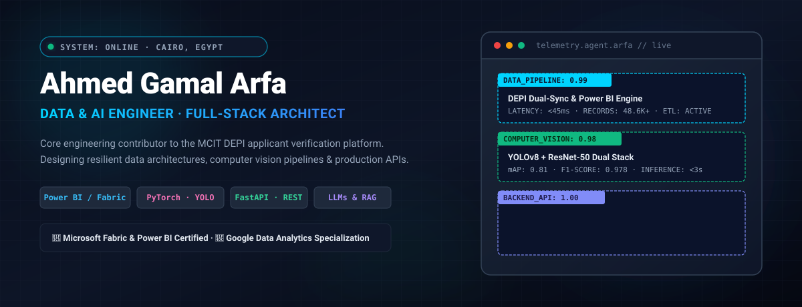
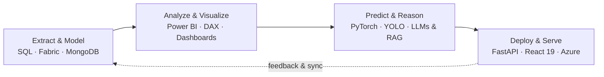
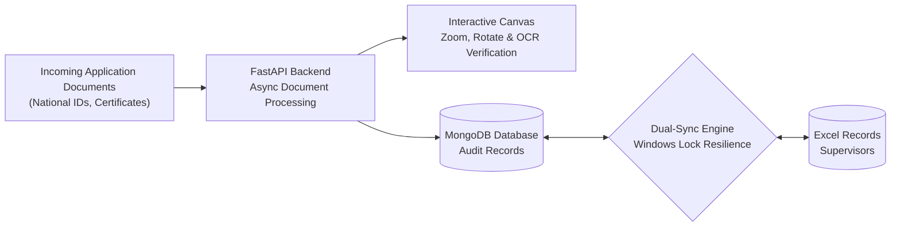
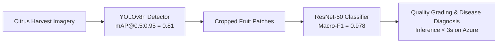
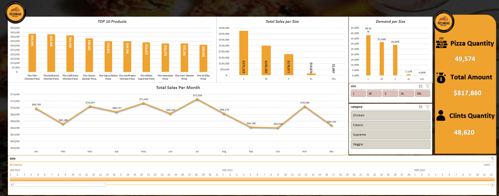
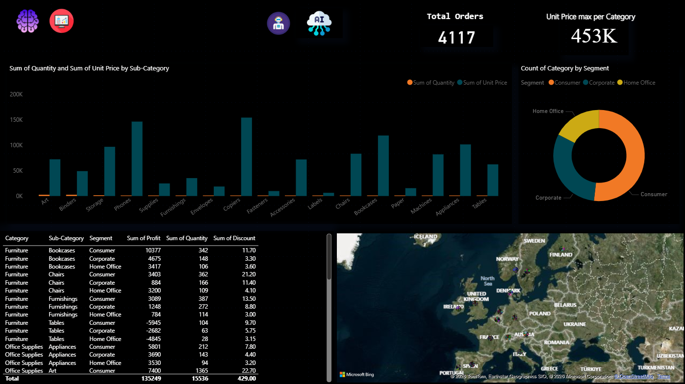
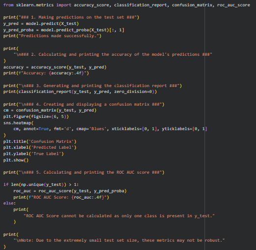

<div align="center">



</div>

## Hi, I'm Ahmed

I turn complex data into actionable intelligence, build resilient full-stack systems, and teach machines to see and reason.
My trajectory connects data engineering, enterprise business intelligence, and production AI: I care about data integrity, model precision, backend resilience, and shipping software that solves real operational problems.
Today I'm a **Data & AI Engineer** and core engineering contributor to the **DEPI Applicant Validation Platform** under the **Egyptian Ministry of Communications and Information Technology (MCIT)**.

```yaml
name:        Ahmed Gamal Arfa
now:         Data & AI Engineer · DEPI Applicant Validation Platform (MCIT)
before:      Full-Stack Developer · Data Analyst & BI Specialist
focus:       data pipelines · computer vision · LLMs & RAG · business intelligence · APIs
location:    Cairo, Egypt
languages:   Arabic (native), English (professional working)
```

## The training curve

Every epoch is an iteration. I built my foundation in software engineering and data analytics, earning a Bachelor of Information Technology with Distinction with Honors. I immersed myself in real-world data pipelines and BI dashboards, earned professional certifications from Microsoft (**Fabric Analytics Engineer Associate** and **PL-300 Power BI Data Analyst Associate**) and Google (**Data Analytics Professional Certificate**), and advanced into applied computer vision, RAG architectures, and scalable FastAPI/React full-stack engineering.

Today, my models and pipelines don't stay trapped in notebooks—they run in production systems serving thousands of users.

## Three disciplines, one loop



| Discipline | What it means in practice |
|---|---|
| **Data & BI** | Microsoft Fabric, Power BI (PL-300), DAX, and SQL. I model relational structures and build executive dashboards that cut reporting cycles by 60% and clarify business drivers. |
| **Machine Learning & AI** | Object detection with YOLOv8, deep classification with ResNet-50, Scikit-learn tabular models (97%+ accuracy), and RAG conversational pipelines for real-world domains. |
| **Backend & Architecture** | High-throughput asynchronous FastAPI services, JWT security, RBAC authorization, and automated dual-synchronization engines between MongoDB and Excel. |
| **Ship & Scale** | Production deployments on Microsoft Azure, Docker containers, resilient self-healing architectures, and responsive React 19 / Tailwind interfaces. |

## Selected work

| Project | What it is | Stack |
|---|---|---|
| [**DEPI Applicant Validation Solution**](https://github.com/MCIT-DEPI/DEPI-Validation-Solution) | National applicant verification and document audit platform for MCIT DEPI with OCR inspection and dual-sync engine. | FastAPI, MongoDB, React 19, Vite, OCR |
| [**NILEX.AI**](https://github.com/AhmdArFa/Nilex-Web) | Smart agro-export decision-support system featuring sub-3s YOLOv8n fruit detection and ResNet-50 citrus disease classification. | PyTorch, YOLOv8, ResNet-50, Azure, Power BI, FastAPI |
| **Pizza Sales BI Dashboard** | Executive Business Intelligence dashboard analyzing $817.8K+ revenue, 48.6K+ orders, and operational KPIs. | Power BI, DAX Measures, Power Query, Data Modeling |
| [**Global Superstore Analytics**](https://github.com/AhmdArFa/Analysis-for-Orders) | Geospatial and financial analytics across 4,117 retail orders, tracking category profitability and regional margins. | Power BI, Geospatial Mapping, DAX, SQL |
| **ML Model Evaluation Suite** | End-to-end classification benchmarking pipeline with confusion matrix heatmaps, ROC-AUC, and 97%+ accuracy. | Python, Scikit-learn, Seaborn, Matplotlib |

<details>
<summary><b>Inside DEPI Validation Solution</b>: dual-sync and self-healing architecture</summary>

<br>



Designed to solve synchronization bottlenecks in government scholarship auditing, the platform features a **Dual-Sync engine** linking MongoDB with supervisor Excel sheets without file corruption, complemented by a **Self-Healing Master Admin** recovery routine.

</details>

<details>
<summary><b>Inside NILEX.AI</b>: dual-model vision pipeline with sub-3s inference</summary>

<br>



Combines fruit localization and pathology grading into a single cloud microservice deployed on **Microsoft Azure**, augmented by an Arabic voice assistant and Power BI telemetry.

</details>

<details>
<summary><b>Inside the Analytics Dashboards</b>: interactive visual telemetry</summary>

<br>

<p align="center">
  
  <br><sub><b>Figure 1:</b> Power BI Sales Performance & Operational Telemetry ($817K+ Revenue, 48.6K+ Orders)</sub><br><br>
  
  <br><sub><b>Figure 2:</b> Global Retail Superstore Sales & Distribution Analytics (4,117 Orders)</sub><br><br>
  
  <br><sub><b>Figure 3:</b> Supervised ML Diagnostic Matrix & Multi-Class Classification Performance</sub>
</p>

</details>

## How I work

- **Data integrity first.** If the ingestion pipeline is compromised, every downstream metric and model is meaningless.
- **Measure before claiming.** Real numbers from rigorous validation over assumptions (precision, recall, mAP, and business ROI).
- **Engineered for production.** A model that only exists in a Jupyter notebook never solved an actual business problem.
- **Self-healing and fault-tolerant.** Design systems to anticipate failures, network spikes, and concurrent file locks.

## Toolbox

| Area | What I use |
|---|---|
| AI and Vision | Python, PyTorch, YOLOv8, ResNet-50, OpenCV, Scikit-learn, RAG, LLMs, Document OCR |
| Data and BI | Microsoft Fabric, Power BI, DAX, Power Query, SQL Server, PostgreSQL, MongoDB, Pandas, NumPy |
| Backend and APIs | FastAPI, RESTful APIs, JWT Authentication, RBAC, Python AsyncIO, Node.js |
| Front-end and Design | React 19, Vite, Tailwind CSS, JavaScript, HTML5/CSS3, UI/UX Design |
| Cloud and DevOps | Microsoft Azure, AWS, Docker, Git, GitHub, Linux, Postman |

## Credentials

- **Microsoft Certified: Fabric Analytics Engineer Associate** (2026–2027)
- **Microsoft Certified: Power BI Data Analyst Associate (PL-300)** (2026–2027)
- **Google Data Analytics Professional Certificate** (Complete 8-Course Specialization, 2026)
  - [Foundations: Data, Data, Everywhere](https://coursera.org/verify/S23651PTKDWB) · [Ask Questions to Make Decisions](https://coursera.org/verify/YOR8X7CUIG9K)
  - [Prepare Data for Exploration](https://coursera.org/verify/KQN3572RFIWW) · [Process Data from Dirty to Clean](https://coursera.org/verify/NV6IXEMV2XKY)
  - [Analyze Data to Answer Questions](https://coursera.org/verify/Z1H7JVQL6YNN) · [Share Data Through Visualization](https://coursera.org/verify/96USRGISXFWY)
- **AWS & Manara**: Machine Learning Engineer & AI Practitioner (2026)
- **Stanford Online & DeepLearning.AI**: Supervised Machine Learning: Regression & Classification (Andrew Ng)
- **Duke University**: Retrieval-Augmented Generation (RAG)
- **MathWorks**: Image Processing and Image Segmentation
- **Information Technology Institute (ITI)**: Database Fundamentals
- **Bachelor of Information Technology**, Distinction with Honors

## Get in touch

I'm open to conversations about data engineering, applied AI / computer vision, and high-performance backend systems.

[Portfolio](https://arafa-a.lovable.app/) · [LinkedIn](https://www.linkedin.com/in/ahmed-gamal-arfa/) · [Email](mailto:anaarafa2019@gmail.com) · [Mostaql](https://mostaql.com/u/Ahmed_gaml23) · [Khamsat](https://khamsat.com/user/arafa_a)
