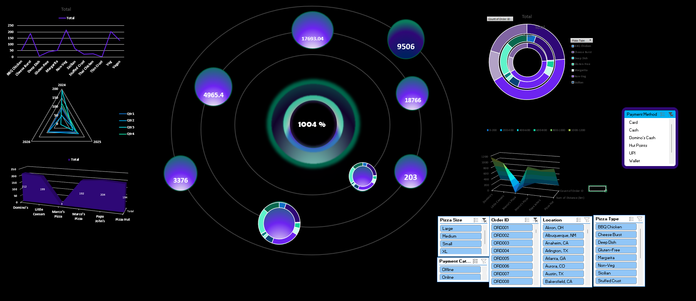

<!-- Profile Avatar & Header -->

# Ahmed Gamal Arfa
### 🚀 Data & AI Engineer | Machine Learning Specialist | Full-Stack & Backend Architect
**Microsoft & Google Certified | MCIT DEPI Engineering Team Member**

  

<!-- Quick Action Badges -->

  
  
  
  
  

---

## 👨‍💻 Professional Summary

Results-driven **Data & AI Engineer** and **Software Architect** with demonstrated experience building production-grade machine learning pipelines, robust backend architectures, and high-impact business intelligence solutions:

- 🏛️ **National & Enterprise Systems**: Core contributor to the applicant auditing and document validation system for the **Digital Egypt Pioneers Initiative (DEPI)** under the **Ministry of Communications and Information Technology (MCIT)**, handling thousands of candidates with intelligent OCR document verification and dual-sync database engines.
- 📊 **Business Intelligence & Advanced Analytics**: Engineered enterprise-grade **Power BI** executive dashboards and automated **SQL ETL** pipelines, slashing managerial reporting cycles by **60%** and uncovering actionable growth metrics.
- 🤖 **Computer Vision, ML & Generative AI**: Architected state-of-the-art computer vision models (**YOLOv8** & **ResNet-50**) achieving **>97% accuracy** for agricultural quality grading, alongside custom **RAG** and **LLM** conversational agents.
- ⚙️ **High-Performance APIs & Full-Stack**: Built secure, scalable RESTful services powered by **FastAPI**, **MongoDB**, **PostgreSQL**, and modern **React 19** with role-based access control (RBAC) and JWT authentication.

---

## 🏆 International Certifications & Credentials

| Issuing Body | Credential Title | Details & Verification |
|:---|:---|:---|
| **Microsoft** | 🏅 **Fabric Analytics Engineer Associate** | Officially Certified (2026–2027) |
| **Microsoft** | 🏅 **Power BI Data Analyst Associate (PL-300)** | Officially Certified (2026–2027) |
| **Google** | 📜 **Google Data Analytics Professional Certificate** | Completed All 8 Specialization Courses |
| ↳ *Course 1* | Foundations: Data, Data, Everywhere | [Verify on Coursera](https://coursera.org/verify/S23651PTKDWB) • [PDF Certificate](./assets/certificates/google-foundations-data.pdf) |
| ↳ *Course 2* | Ask Questions to Make Data-Driven Decisions | [Verify on Coursera](https://coursera.org/verify/YOR8X7CUIG9K) • [PDF Certificate](./assets/certificates/google-ask-questions.pdf) |
| ↳ *Course 3* | Prepare Data for Exploration | [Verify on Coursera](https://coursera.org/verify/KQN3572RFIWW) • [PDF Certificate](./assets/certificates/google-prepare-data.pdf) |
| ↳ *Course 4* | Process Data from Dirty to Clean | [Verify on Coursera](https://coursera.org/verify/NV6IXEMV2XKY) • [PDF Certificate](./assets/certificates/google-process-data.pdf) |
| ↳ *Course 5* | Analyze Data to Answer Questions | [Verify on Coursera](https://coursera.org/verify/Z1H7JVQL6YNN) • [PDF Certificate](./assets/certificates/google-analyze-data.pdf) |
| ↳ *Course 6* | Share Data Through the Art of Visualization | [Verify on Coursera](https://coursera.org/verify/96USRGISXFWY) • [PDF Certificate](./assets/certificates/google-share-data-visualization.pdf) |
| **AWS & Manara** | ☁️ **AWS: Machine Learning Engineer & AI Practitioner** | Applied Track & Production AI |
| **Stanford & DeepLearning.AI** | 🧠 **Supervised Machine Learning: Regression & Classification** | Directed by Prof. Andrew Ng |
| **Duke University** | 🔗 **Retrieval-Augmented Generation (RAG) & LLMs** | Applied Generative AI Systems |
| **MathWorks** | 🖼️ **Image Processing & Segmentation** | Digital Image Processing & Feature Extraction |
| **ITI** | 🗄️ **Database Fundamentals** | Information Technology Institute (MCIT) |

> 🔗 Complete digital verification portfolio available at: [arafa-a.lovable.app](https://arafa-a.lovable.app/)

---

## 🛠️ Technical Arsenal

### 🧠 Artificial Intelligence & Machine Learning

### 📊 Data Engineering & Business Intelligence

### ⚙️ Backend & Full-Stack Development

### ☁️ Cloud, DevOps & Environment

---

## 🚀 Featured Flagship Projects

### 1. 🏛️ [DEPI Applicant Validation & Audit Solution](https://github.com/MCIT-DEPI/DEPI-Validation-Solution)
> **National-scale applicant verification and document audit platform for the Ministry of Communications & Information Technology (MCIT - DEPI)**

- **Architecture**: Scalable asynchronous **FastAPI** backend integrated with **MongoDB** and modern **React 19** frontend.
- **Dual-Sync Synchronization**: Engine bridging MongoDB with live Excel files, designed with Windows file-lock bypass algorithms to prevent data loss.
- **Self-Healing Infrastructure**: Resilience mechanisms with self-healing superadmin recovery and automated auditing traces.
- **Smart Inspection Canvas**: Interactive inspection canvas allowing dynamic zoom, rotate, and multi-angle verification of national ID cards and academic certificates.

---

### 2. 🍊 [NILEX.AI — Smart Agro-Export Intelligence Ecosystem](https://github.com/AhmdArFa/Nilex-Web)
> **AI decision-support and computer vision platform for export-grade citrus sorting and disease inspection**

- **Computer Vision Pipeline**: High-precision dual-model stack combining **YOLOv8n** for real-time fruit detection (`mAP@0.50:0.95 = 0.81`) and **ResNet-50** for disease classification (`Macro-F1 = 0.978`) with inference latency under 3 seconds.
- **Cloud Microservices**: Deployed on **Microsoft Azure** with **PostgreSQL** relational storage and **Power BI** analytical telemetry.
- **Generative AI Assistant**: Integrated domain-specific **RAG** knowledge base with Arabic Speech-to-Text capability for field operators.

---

### 3. 🍕 Pizza Sales Performance & Executive BI Dashboard
> **Interactive Business Intelligence dashboard engineered in Power BI for comprehensive sales and operational telemetry**

- **Key Highlights & KPIs**:
  - Analyzed **$817,860** in total revenue across **48,620** orders and **49,574** pizzas sold.
  - Granular breakdown of top 10 bestselling pizzas, category contributions, and size preferences.
  - DAX time-intelligence metrics tracking weekday vs. weekend spikes and monthly seasonality.
- **Tech Stack**: Power BI, DAX Measures, Power Query ETL, Dimensional Data Modeling.

  

---

### 4. 🎯 Machine Learning Pipeline & Model Evaluation Suite
> **End-to-end classification benchmarking pipeline with comprehensive diagnostic metrics and visual telemetry**

- **Key Highlights & KPIs**:
  - Implemented multi-model evaluation achieving **>97% classification accuracy**.
  - Generated automated diagnostic reports including precision, recall, F1-score, and ROC-AUC curves.
  - Seaborn and Matplotlib customized heatmaps for in-depth confusion matrix error inspection.
- **Tech Stack**: Python, Scikit-learn, Pandas, NumPy, Matplotlib, Seaborn.

  

---

### 5. 🌍 [Global Superstore Sales & Distribution Analytics](https://github.com/AhmdArFa/Analysis-for-Orders)
> **Geospatial and financial analytics dashboard analyzing global retail transactions and customer segment profitability**

- **Key Highlights & KPIs**:
  - Analyzed **4,117** global customer orders across Consumer, Corporate, and Home Office segments.
  - Deep-dive into unit price variations (up to **$453K** peak categories), discounts, and net margins.
  - Global choropleth map tracking regional sales velocity and market penetration.
- **Tech Stack**: Power BI, Geospatial Modeling, DAX, Advanced Filtering.

  

---

### 6. 🥧 Advanced Multi-Dimensional Pizza Analytics
> **Advanced circular and gauge visualization suite evaluating operational and fulfillment distributions**

- **Key Highlights**:
  - Specialized radial visualizations monitoring order distribution across peak operational windows.
  - Comprehensive dimension drill-downs by pizza category, crust size, and preferred payment channels.
- **Tech Stack**: Power BI / Tableau, Advanced Data Visualization.

  

---

## 📊 Live GitHub Telemetry

 

---

## 💼 Freelance Services & Consultation

Available for specialized consulting and delivery in:
- 📊 **Power BI & Business Intelligence**: Custom dashboards, complex DAX formulation, and automated reporting.
- 🗄️ **Data Engineering & ETL**: SQL architecture, data warehouse modeling, and cross-platform automated pipelines.
- 🤖 **Applied Machine Learning & AI**: Computer vision, classification models, document OCR, and custom RAG solutions.
- ⚡ **Backend & API Engineering**: High-throughput FastAPI backends, secure auth systems, and cloud integration.

---

## 📬 Connect With Me

 

*"Transforming complex data into actionable intelligence and engineering resilient, intelligent software systems."*

